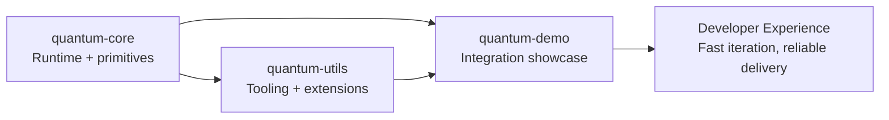

<div align="center">


<br />
<br />


[](https://github.com/)


[](#project-status)
[](#architecture-direction)
[](#roadmap)
[](./LICENSE)

</div>

---

## Quantum Forge

Quantum Forge is an engineering-focused initiative dedicated to shipping the next generation of **web frameworks** and **developer tooling**.

Our mission is simple:

- Deliver performance-first architecture
- Keep systems modular and composable
- Build for long-term maintainability and scale
- Enable teams to move faster with less friction

---

## Visual Identity

- Primary logo path: `./assets/quantum-forge-logo.png`
- Hero style: deep-spectrum gradient + neon edge highlights
- Brand tone: technical, premium, modern systems engineering

---

## Strategic Repositories

These are intentionally large, evolving, and currently unfinished initiatives:

### 1) `quantum-core`
**Role:** Core runtime + framework primitives  
**Focus:** execution model, extensibility contracts, internal performance pathways

### 2) `quantum-utils`
**Role:** Tooling ecosystem + supporting modules  
**Focus:** diagnostics, task orchestration, CLI utilities, workflow acceleration

### 3) `quantum-demo`
**Role:** End-to-end showcase and validation harness  
**Focus:** proving real-world integration patterns across core + utilities

---

## Architecture Direction



---

## Project Status

> This organization is in active build mode.

- Large scope
- Rapid iteration
- Incomplete by intent
- Public-facing structure being hardened in parallel with implementation

If you are evaluating progress: this is a **high-throughput engineering phase**, not a finished product phase.

---

## Delivery Model

### Build Principles
- Performance is a baseline, not a feature
- Modular boundaries are enforced early
- Tooling quality is treated as product quality
- Documentation evolves with implementation

### Working Style
- Ship in vertical slices
- Validate with executable demos
- Keep APIs narrow until stable
- Optimize once behavior is correct and measurable

---

## Signature Stack

<div align="center">


</div>

---

## Roadmap

### Near Term
- Expand runtime command and plugin surface in `quantum-core`
- Harden diagnostics/task systems in `quantum-utils`
- Increase real integration scenarios in `quantum-demo`

### Mid Term
- Introduce formal extension contracts and compatibility matrix
- Publish benchmark and profiling workflows
- Add automated release health checks and validation gates

### Long Term
- Stabilize public APIs
- Document migration patterns across major versions
- Establish production reference implementations

---

## Repository Standards

- Clean commit history per repository
- Changelog-driven evolution
- Contract tests for shared boundaries
- Deterministic local build and test commands
- Security and performance checks as first-class CI signals

---

## Quick Local Validation

```bash
npm --prefix quantum-core test && npm --prefix quantum-core run build
npm --prefix quantum-utils test && npm --prefix quantum-utils run build
npm --prefix quantum-demo test && npm --prefix quantum-demo run build
node quantum-demo/src/cli.js doctor
```

---

## Contribution Posture

External contribution flow will be formalized as the repos stabilize.

Until then, priority is:
- architectural correctness
- internal velocity
- measurable performance progress

---

<div align="center">


<br />


**Quantum Forge**  
*Future-proof frameworks. Practical tooling. Engineered for serious builders.*

</div>

